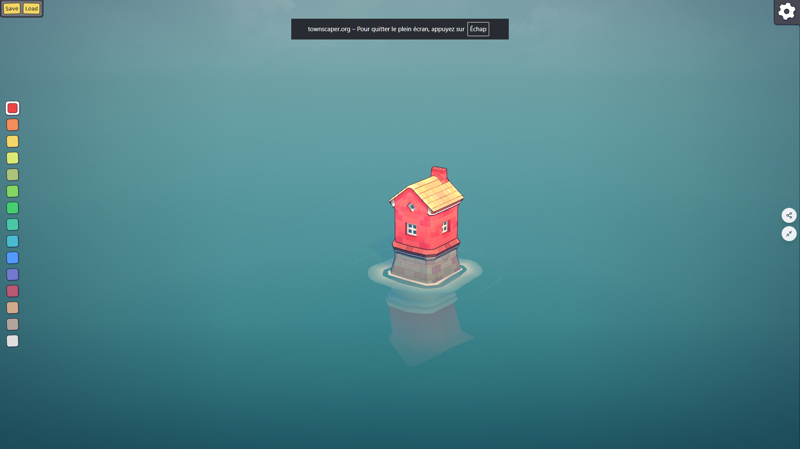
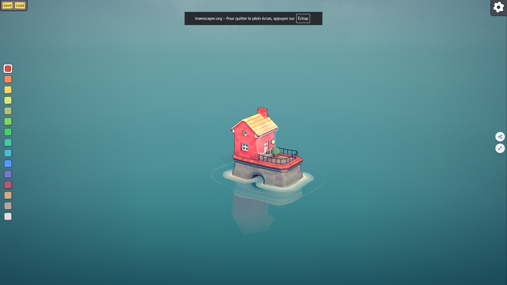

# Château — refonte visuelle (texture, contour, eau, socle)

*Document de conception — 2026-08-07. Ne remplace pas
`2026-08-06-chateau-townscaper-design.md` : ce document ne touche ni au mécanisme de
construction, ni à la géométrie de silhouette (arrondi/rétrécissement/toit) qu'il décrit —
il ne change que l'habillage visuel posé par-dessus.*

## Contexte et portée du changement

Le mécanisme de construction (grille, arrondi automatique des coins, étages rétrécis,
toit à deux pans) est fonctionnel et testé (71 tests, cf. plan du 2026-08-06). Le retour
utilisateur sur le résultat visuel : chaque bâtiment est un bloc de couleur unie surmonté
d'un toit-triangle uni, sans texture, sans contour, sur une eau plate — "ça donne pas envie
de jouer, c'est laid", "ça ressemble à un kit de géométrie pour enfant".

Cinq captures d'écran du vrai townscaper.org ont été examinées directement pendant le
brainstorming pour ancrer la discussion sur du réel plutôt que des suppositions. Deux sont
jointes ci-dessous.

**Correction d'une hypothèse du document du 2026-08-06** : celui-ci affirmait que "le vrai
Townscaper utilise des couleurs douces posées directement sur la géométrie, pas de
texture (les textures se déforment mal sur des surfaces arrondies)". Les captures
montrent le contraire : les murs ont un motif brique peint, le toit un motif tuile, la
base un motif pierre — ce ne sont pas des aplats. Ce document corrige ce point sur la base
de preuve visuelle directe, pas de mémoire.

**Portée strictement limitée au rendu.** Ce chantier ne touche pas :
- le modèle de données de la grille ni le format de sauvegarde (`grid.ts`, `save.ts`) ;
- les mécaniques d'interaction (peindre pour construire, alt-clic pour retirer, seuil de
  glissement, caméra orbitale) ;
- l'algorithme de silhouette (`corners.ts`, `buildFloorShape`, rétrécissement par étage,
  orientation du toit) — ces formes restent exactement ce qu'elles sont aujourd'hui.

Tout ce qui suit s'applique à **ce qui habille** cette silhouette déjà construite :
matériaux, un passage de post-traitement, l'eau, et un nouveau petit niveau de fondation.

## Ce qui, dans les captures, produit l'effet "vraie maison" plutôt que "bloc + triangle"

Observé directement sur les références, pas déduit :
- Le toit a un dégradé clair (faîte) → foncé (bord) qui suggère la tuile, plus un liseré
  clair qui souligne chaque arête (faîtage, bas de toit).
- Les murs portent un motif brique visible, teinté par la couleur du bâtiment — pas un
  aplat — et le même liseré clair souligne les arêtes verticales du volume.
- Les fenêtres sont un simple décalque (petit carré à croisillons, cadre clair) posé sur
  la texture du mur — pas une géométrie complexe.
- La base du bâtiment est un matériau pierre distinct (gris, texturé), différent de la
  couleur du bâtiment — c'est ce socle qui l'ancre visuellement.
- L'eau reflète le bâtiment, avec un halo clair et doux à la ligne de flottaison.

## Design retenu

### 1. Textures peintes procédurales (murs, toit)

Chaque matériau (mur, toit) reçoit une texture générée en code au lieu d'une couleur
unie : motif brique pour les murs, motif tuile (dégradé faîte→bord) pour le toit, teintée
par la couleur choisie dans la palette existante (`palette.ts`). Génération via
`CanvasTexture`, sur le même principe que `skyTexture()` déjà présent dans `scene.ts` —
pas de nouveau fichier image ni de pipeline d'assets à introduire. Une texture par couleur,
générée une fois et partagée entre tous les bâtiments de cette couleur (même logique de
cache que `wallMaterials`/`roofMaterials` dans `main.ts` aujourd'hui).

### 2. Contour clair sur les arêtes

Le liseré qui souligne les arêtes dans les captures. Choix technique : **un post-traitement
en un seul passage sur toute la scène**, plutôt qu'une technique par-bâtiment (coque
inversée dupliquée par maillage) — avec potentiellement des centaines de bâtiments sur une
grille 20×20, dupliquer un maillage de contour par bâtiment multiplierait les objets à
dessiner ; un seul passage plein écran a un coût indépendant du nombre de bâtiments.

### 3. Eau miroir + halo

L'eau (actuellement un simple plan `MeshStandardMaterial` uni) reflète la scène
au-dessus, avec un halo doux à la base de chaque bâtiment, comme dans les captures.
Remplace le matériau d'eau actuel dans `main.ts`.

### 4. Socle en pierre

Un niveau de fondation supplémentaire, texturé pierre grise, ajouté sous chaque colonne de
bâtiment (`buildBuildingColumn` dans `building-geometry.ts`), indépendamment de la couleur
choisie et du nombre d'étages. Un ajout borné : **un socle par bâtiment**, pas un par
étage — ne s'aggrave pas avec `MAX_FLOORS`.

### 5. Fenêtres et porte en décalque

Motif fenêtre à croisillons répété sur la texture du mur, un par étage ; le rez-de-chaussée
reçoit une porte à la place d'une fenêtre. Décalque plat peint dans la texture (comme dans
les captures) — pas de nouvelle géométrie, donc pas de coût de performance supplémentaire.

**Point technique à vérifier en implémentation, pas supposé** : le mapping UV réel produit
par `THREE.ExtrudeGeometry` sur les formes de `buildFloorShape` doit être inspecté avant de
s'appuyer dessus pour positionner les décalques — en particulier parce que chaque étage a
une demi-largeur différente (rétrécissement progressif via `FLOOR_INSET`), qui peut faire
varier l'échelle du motif d'un étage à l'autre.

### 6. Accessoires épars (cheminée, garde-corps) — priorité basse

Petits éléments de géométrie réutilisables et peu coûteux, placés de façon éparse (pas sur
chaque bâtiment) selon un calcul déterministe par case — même principe que l'orientation du
toit déjà déterminée par `(cellX + cellZ) % 2` dans `building-geometry.ts`. Le point le
moins prioritaire des six : à faire en dernier, et à laisser tomber sans regret si le temps
manque, sans que ça remette en cause le reste.

## Non-objectifs (explicite)

- Pas de changement au modèle de données de la grille ni au format de sauvegarde.
- Pas de changement aux mécaniques d'interaction ou à la caméra.
- Pas de changement à la silhouette géométrique des bâtiments (arrondi, rétrécissement,
  pente du toit) — uniquement à ce qui est posé dessus.

## Performance et risques identifiés

- Contour : un seul passage de post-traitement, coût indépendant du nombre de bâtiments.
- Socle : une extrusion de plus par bâtiment, borné (pas par étage).
- Textures : une par couleur, générées une fois et partagées — pas régénérées par
  bâtiment ni par étage.
- Décalques fenêtre/porte : dépendent d'un mapping UV à vérifier réellement (voir section
  5) avant de considérer l'approche acquise.
- Assets de référence : les deux captures jointes pèsent environ 2,6 Mo chacune (PNG plein
  écran non compressés) — à garder en tête pour la taille du dépôt, sans bloquer ce
  chantier.

## Vérification

- La suite de tests automatisés existante (`grid`, `corners`, `palette`, `save` — 71 tests)
  doit rester verte et inchangée : ce chantier ne touche à aucune de ces logiques.
- Toute nouvelle logique pure non triviale ajoutée à cette occasion (génération
  déterministe de texture, placement épars des accessoires) doit avoir ses propres tests.
- Vérification visuelle manuelle via `npm run dev`, comparée directement aux captures de
  référence de ce document — pas seulement "ça compile".
